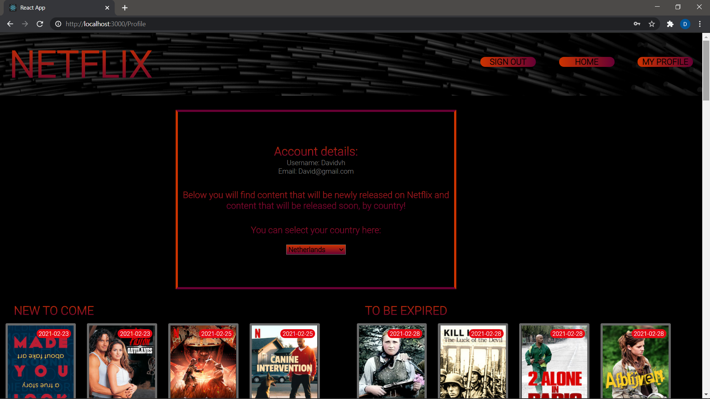

## INSTALLATIE HANDLEIDING.

****1. Inleiding****
   This application is built to clarify availability of Netflix content by country.
   For example, the application shows which films and series are available per country and which films and series are available per country
   will be added and will be picked up soon. Also here are the dates when this will happen and Imdb ratings are visible.

It is also possible to register and log in via the application. The profile page, where you get the upcoming
new films and series and the films and series that will be removed soon, you can only visit if you
registered / logged in.

The main page of the application is the profile page, which can also only be visited if you are registered
are. The photo of the profile page:

;

**2. Requirements**

- You will need an IDE like Webstorm for this application.
- The API is fetched from the following website: 'https://rapidapi.com/unogs/api/unogsng'
You will need to use the following key: ('adc43e01efmsh4e33b30d1f57ef9p1c5965jsn4a48b5e075ce').
  The API URL which is used in this application are:
  - 'https://unogsng.p.rapidapi.com/search'
  - 'https://unogs-unogs-v1.p.rapidapi.com/aaapi.cgi'
  
- Install Node.js and NPM. Instructions can be found on the following website: ('https://www.npm.js.com/get-npm').
- Install Axios in your terminal -> `npm install axios`
- Install react-router-dom -> `npm install react-router-dom`
- Install react-hook-form -> `npm install react-hook-form`

**Start**
1. To start the application, go to your terminal in the IDE and type: `npm start`. 
2. To make use of the application, you can register with clicking on the 'Sign up' button.
3. You will need an username, emailadress, and a password.
4. When signed up, you will see a link to go to the Sign in page, or just click on the Sign in button in the header.
5. Fill in your username and password and you will be directed to the profile page. 
6. On the profile page, you can see information of upcoming and to be deleted content of Netflix. You can select your
country on the select bar and it will automaticly update.
7. On the Home page you can look up any movie or serie available on Netflix worldwide. When clicking on the picture,
you will see in which countries the movie or serie is available.
